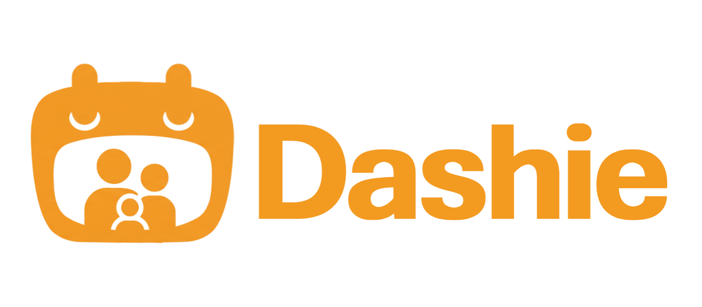

<p align="center">
  
</p>

<h3 align="center">A Smarter Smart Home — for Home Assistant</h3>

<p align="center">
  <a href="https://github.com/sponsors/jwlerch78">
    
  </a>
</p>

---

**A free alternative to Fully Kiosk for hosting your dashboards on Android tablets. Voice enable
it for an even smarter smart home.**

Dashie provides easy hosting of Home Assistant dashboards on Android tablets. Get your smart home
dashboard up and running in minutes with a clean, purpose-built kiosk experience. Add voice
activation and say "Hey Dashie" to control your devices.

Dashie for Home Assistant is available for sideloading or download through the Amazon Appstore
and Google Play Store on this
[downloads page](https://heydashie.com/dashie-kiosk-download).

**Home Assistant integration:**
[jwlerch78/dashie-ha-integration](https://github.com/jwlerch78/dashie-ha-integration) — install it
from HACS to get auto-discovery of your Dashie tablets in Home Assistant, plus controls, sensors,
and camera and video-feed entities. Setup steps are in the
[integration guide](https://heydashie.com/guides/home-assistant-integration).

This repository is the source of the app, under the [AGPL-3.0](LICENSE). Two of the bundled web
assets cannot be rebuilt from this tree alone — [PROVENANCE.md](PROVENANCE.md) says which, and
why.

<!-- HIDDEN UNTIL THE HA EDITION RELEASES (decision, 2026-08-22). The INTEGRATION link came out
     of this block on 2026-08-24 and is live above — it ships today (HACS, 1.4.x). What remains
     hidden is only the ADD-ON, which has no prod release yet. Restore by deleting this wrapper.
**Add-on:** [dashie-ha](https://github.com/jwlerch78/dashie-ha)
-->

---

## What's Included

| | |
|---|---|
| **Screensaver & Photos** | Photo slideshows from multiple sources with motion-activated wake. |
| **Lock Mode** | Lock your tablet with an optional PIN to prevent unintended use. |
| **Free to Use** | No account and no subscription — install it and point it at Home Assistant. |
| **Voice Control** | "Hey Dashie" wake word with natural language voice commands. |
| **Video Streaming** | Stream your tablet's camera as an RTSP feed and view incoming feeds on demand or when triggered. |
| **Home Assistant Integration** | Display any dashboard with a built-in API that's backwards compatible with the Fully Kiosk integration. |
| **Battery Management** | Manage your tablet's charging without HA automations for optimal battery longevity. |
| **Music Player** | Play music across your Dashie tablets using multi-room audio with Music Assistant. |

Tested on Fire HD tablets, Samsung Galaxy Tab A-series, Fire TV, and generic Android kiosk
panels. Minimum Android 6.0 (API 23).

## Getting started guides

[Features Overview](https://heydashie.com/guides/dashie-kiosk-features) ·
[Voice Control Setup](https://heydashie.com/guides/voice-control-setup) ·
[Android Tablet Sideloading](https://heydashie.com/guides/fire-tablet-sideload) ·
[Dashie HACS Integration](https://heydashie.com/guides/home-assistant-integration) ·
[All guides](https://heydashie.com/guides/)


## Building it yourself

```bash
# 1. Fetch the on-device speech engine. Not optional — read the warning.
./scripts/fetch-stt-models.sh

# 2. Build.
./gradlew assembleProdDebug
adb install -r app/build/outputs/apk/prod/debug/Dashie-prod-*.apk
```

You need a JDK 17 or later and an Android SDK with API 36. Release builds fall back to the debug
keystore when the upload key is absent, so `./gradlew assembleSideloadRelease` works on a machine
with none of our state — the APK is installable, just not publishable.

> ⚠️ **If you skip step 1 the APK will work — but the on-device voice recognition won't.**
>
> `app/src/sttEngine/` and `app/src/sttVad/` are gitignored and downloaded by that script
> (sha256-pinned against [k2-fsa/sherpa-onnx](https://github.com/k2-fsa/sherpa-onnx) releases).
> Without them the app logs the engine as unavailable and falls back to the HA Assist pipeline.
>
> Gradle will **not** warn you: a missing source-set directory is silently ignored, so the build
> succeeds and you get a smaller APK with no speech engine in it (38 MB rather than 77 MB on a
> clean clone). Speech models themselves are downloaded by the app when you enable on-device
> voice — you do not need them to build.

Build flavors pick the update channel and packaging: `prod`, `staging`, `local`, `firetv`,
`amazon`, `sideload`. The kiosk behaves identically in all of them. `build.gradle.kts` declares
four more — the `chickadee*` flavors of the paused experiment described in
[PROVENANCE.md](PROVENANCE.md); no Dashie build uses them.

## What's in here

```
app/src/main/java/com/dashieapp/Dashie/
├── halite/            # the kiosk — the bulk of the app
│   ├── voice/         #   wake word, STT/TTS pipelines, intent handling
│   ├── settings/      #   native settings UI (schema-driven)
│   ├── preferences/   #   SharedPreferences domains + cloud sync
│   ├── music/         #   Music Assistant player + sync audio
│   ├── videofeed/     #   camera cards (RTSP/MJPEG, Frigate playback)
│   ├── timer/         #   voice timers + alarms
│   └── sidebar/       #   control center, popouts
├── api/               # the local HTTP API on port 2323 — the Fully Kiosk-compatible one
├── webview/           # WebView shell + JS bridge
└── audio/             # mic capture, VAD, echo cancellation
microfrontend/            # JNI wrapper around TFLite Micro's audio frontend
third_party/              # vendored AARs + every redistributed licence text
tools/aec3-build/         # build recipe for the WebRTC AEC3 library we ship
tools/kiosk-overlay-build/ # esbuild config for the kiosk overlay bundles
```

The kiosk overlay at `app/src/main/assets/webapp/` is a small web app the WebView loads from
inside the APK. Source and build config are both here, with more details in
[`tools/kiosk-overlay-build/README.md`](tools/kiosk-overlay-build/README.md).

## Provenance

How this repository relates to the private one it is published from, what is and is not
reproducible from this tree, and what the commercial half of the app is doing in here — all in
[PROVENANCE.md](PROVENANCE.md).

## Issues and pull requests

Bug reports and feature requests are genuinely wanted — [open an issue](../../issues). Real HA
setups on real hardware are the thing one maintainer cannot manufacture. Device model, Android
version, Dashie version, and what you expected are the four things that make a report actionable.

Pull requests are not accepted — this tree is published from a private repo, so a merge here does
not exist upstream. See [CONTRIBUTING.md](.github/CONTRIBUTING.md). You can fork it, run it, and
change it for yourself per the license. If you have a fix, please describe it in an issue with
the file and I'll review it directly.

## Support development

Dashie is built and maintained by one person. The Home Assistant side is free with no account,
subscription, or feature-gating. If you like it please support it through
[GitHub Sponsors](https://github.com/sponsors/jwlerch78)! Not sponsoring is completely fine too.

There is billing code in this repository. Voice and AI tools can optionally run through Dashie's
hosted cloud inference as a convenience and privacy enhancement. This costs Dashie money so we
need to pass the cost on. That path needs an account and is entirely opt-in — and it always has a
free alternative offered alongside it: bring your own API key or use a local model. Nothing in the
Home Assistant experience above is gated behind payment.

## License

[AGPL-3.0](LICENSE), including the network-use clause, with additional permissions under
section 7 for the Google Play, Play services, ML Kit and Eclipse Paho components the app links —
see [LICENSE-EXCEPTIONS.md](LICENSE-EXCEPTIONS.md).

Third-party code and models redistributed here stay under their own licences, listed in
[NOTICE](NOTICE) with full texts in [`third_party/licenses/`](third_party/licenses/).

Wake-word models: `hey_dashie` is ours. `okay_nabu`, `hey_jarvis`, `hey_mycroft` and `alexa` are
bundled unmodified from
[esphome/micro-wake-word-models](https://github.com/esphome/micro-wake-word-models) under
Apache-2.0 — credit to the [microWakeWord](https://github.com/kahrendt/microWakeWord) and
[openWakeWord](https://github.com/dscripka/openWakeWord) communities.
